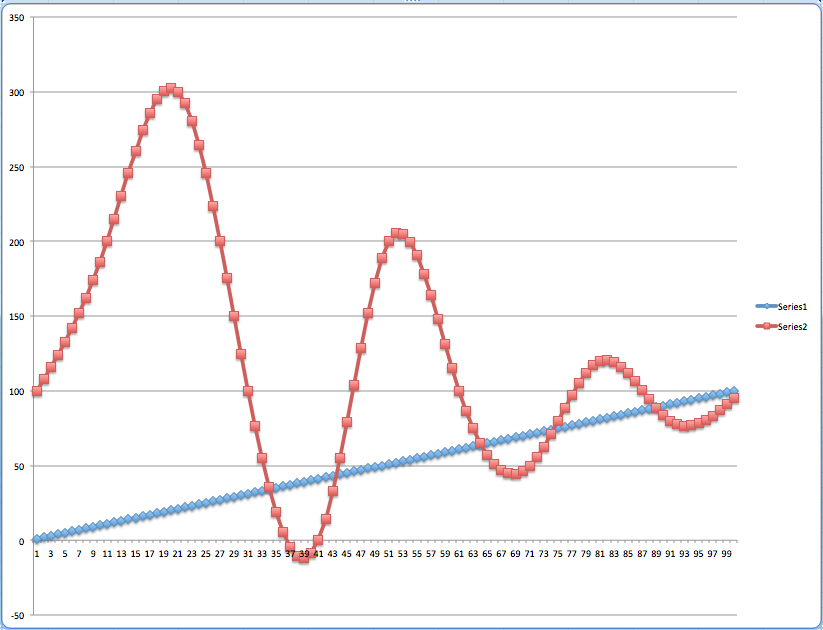
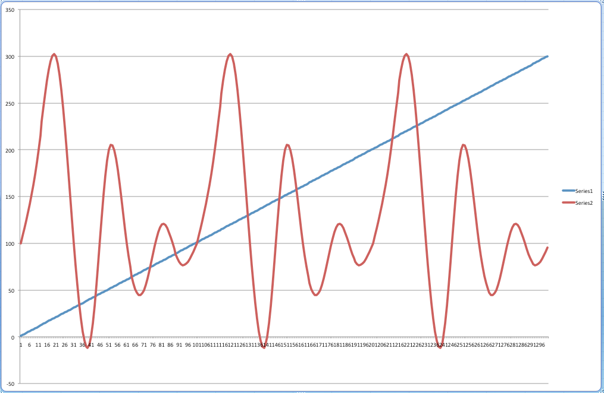

  
  
#         Velociraptor

#### Time Series Device Modeling Tool

Velociraptor was created to model a scalable amount of devices that generate dynamic data using different interpolation methods to dynamicly create sensors in a device.  It allows you to create and start/stop all or individual device(s) using REST API.  During a modeling you may change a device's profile to generate data. 

## Installation and launch
 - clone repository  
    `>git clone <github repository>`
    
    How to run this java app
 
   ```    
java \
       -Dsim.timeseries.zoneid=<time zone id> \
       -Dsim.timeseries.predixOathHostname=https://<Oath Host Name>/oauth/token  \
       -Dsim.timeseries.passwordPair=<UAA Time Series client:password>  \
       -Dsim.timeseries.wssUrl=wss://gateway-predix-data-services.run.aws-usw02-pr.ice.predix.io/v1/stream/messages  \
-jar target/ts-velociraptor-demo-1.0.0.jar

  ``` 
  
  Your java command lines should look like this
   ```    
java \
       -Dsim.timeseries.zoneid=d1d23456-6677-1234-1234-e85f76c83723 \
       -Dsim.timeseries.predixOathHostname=https://012345f6-1a50-4bb5-a123-01a2e34a46a7.predix-uaa.run.aws-usw02-pr.ice.predix.io/oauth/token  \
       -Dsim.timeseries.passwordPair=client:secret  \
       -Dsim.timeseries.wssUrl=wss://gateway-predix-data-services.run.aws-usw02-pr.ice.predix.io/v1/stream/messages  \
-jar target/ts-velociraptor-demo-1.0.0.jar

  ``` 
    
##### Simple test with default sensor "temp" 
  ```   
http://localhost:8080/test

send test 10 datapoint with generated tag name that returned after sent 

e6428c30-86e8-4f4a-821c-facd13758d1f:1

e6428c30-86e8-4f4a-821c-facd13758d1f - UUID generated tag name 
1 - time to send the test message in milliseconds

http://localhost:8080/test?t=300

2c48626c-047c-4cdc-a425-e20cfb8fe8df:1359
2c48626c-047c-4cdc-a425-e20cfb8fe8df - UUID generated tag name
1359 - time to send the test message in milliseconds
```
All message details can be observed on your spring boot console

##### Post - added new device - simple test with one predefined sensor "temp"
  ```
http://localhost:8080/config

{
  "name": "101",
  
  "schedule":20,
  
  "frequency":1000,  
  
  "start": false
}
   ```
   
##### Post - added new device - complex with multiply sensors and data sets for X and Y coordinates with interpolation method
   
   ```
   http://localhost:8080/config
{
  "name": "SIM0_",
  "schedule":40,
  "frequency":1000,  
  "start": false, 
  "sensors":[{"sensor" : "Vibration", 
               "method" : "spline", 
               "x":[0.00, 10.0, 20.0, 30.0, 40.0],
               "y":[1.00, 2.0, 3.0, 2.0, 1.0]
              },
              {"sensor" : "RotorSpead", 
               "method" : "spline", 
               "x":[0.00, 10.0, 20.0, 30.0, 40.0],
               "y":[100.00, 200.0, 300.0, 200.0, 100.0]
              },
              {"sensor" : "Temperature", 
               "method" : "line", 
               "x":[0.00, 10.0, 20.0, 30.0, 40.0],
               "y":[10.00, 20.0, 30.0, 20.0, 10.0]
              }
    ]
 
}
 
  ```
  
#### Visual example of how the vibration sensor generates 100 data points with the spline method
  
  
  
##### Post - create device with 100 data points using a Vibration sensor with spline method interpolation using 11 data points for interpolation.  

  ```
    http://localhost:8080/config
    
   {
  "name": "SIM0_TEST",
  "schedule":100,
  "frequency":1000,  
  "start": false, 
  "sensors":[
              {"sensor" : "Vibration", 
               "method" : "spline", 
               "x":[0.00,    10.0,  20.0,  30.0, 40.0,  50.0,  60.0, 70.0,  80.0, 90.0, 100.0],
               "y":[100.00, 200.0, 300.0, 100.0,  0.0, 200.0, 100.0, 50.0, 120.0, 80.0, 100.0]
              }
    ]
 
}
 
  ```
  
  
  
  The same modeling series with 300 data points generated in the Time Series
  
  
##### Post - generate new 100 devices with 3 sensors: Vibration, RotorSpead, Temperature
 
  ``` 
 http://localhost:8080/config/gen?t=100
 
{
  "name": "SIM0_",
  "schedule":40,
  "frequency":1000,  
  "start": false, 
  "sensors":[{"sensor" : "Vibration", 
               "method" : "spline", 
               "x":[0.00, 10.0, 20.0, 30.0, 40.0],
               "y":[1.00, 2.0, 3.0, 2.0, 1.0]
              },
              {"sensor" : "RotorSpead", 
               "method" : "spline", 
               "x":[0.00, 10.0, 20.0, 30.0, 40.0],
               "y":[100.00, 200.0, 300.0, 200.0, 100.0]
              },
              {"sensor" : "Temperature", 
               "method" : "line", 
               "x":[0.00, 10.0, 20.0, 30.0, 40.0],
               "y":[10.00, 20.0, 30.0, 20.0, 10.0]
              }
    ]
 
}
Generates 100 devices (default 10) that send 40 data points every 40 seconds (schedule) in 3 web socket message per sensor: Vibration, RotorSpead, Temperature

  ```
  
##### Get info - list all devices (2 devices with generated prefix name SIM_) 
  ```
http://localhost:8080/info
{
    "SIM0_1": {
        "name": "SIM0_1",
        "format": "boxcar",
        "schedule": 40,
        "frequency": 1000,
        "start": false,
        "sensors": [
            {
                "sensor": "Vibration",
                "method": "spline",
                "x": [
                    0,
                    10,
                    20,
                    30,
                    40
                ],
                "y": [
                    1,
                    2,
                    3,
                    2,
                    1
                ]
            },
            {
                "sensor": "RotorSpead",
                "method": "spline",
                "x": [
                    0,
                    10,
                    20,
                    30,
                    40
                ],
                "y": [
                    100,
                    200,
                    300,
                    200,
                    100
                ]
            },
            {
                "sensor": "Temperature",
                "method": "line",
                "x": [
                    0,
                    10,
                    20,
                    30,
                    40
                ],
                "y": [
                    10,
                    20,
                    30,
                    20,
                    10
                ]
            }
        ]
    },
    "SIM0_0": {
        "name": "SIM0_0",
        "format": "boxcar",
        "schedule": 40,
        "frequency": 1000,
        "start": false,
        "sensors": [
            {
                "sensor": "Vibration",
                "method": "spline",
                "x": [
                    0,
                    10,
                    20,
                    30,
                    40
                ],
                "y": [
                    1,
                    2,
                    3,
                    2,
                    1
                ]
            },
            {
                "sensor": "RotorSpead",
                "method": "spline",
                "x": [
                    0,
                    10,
                    20,
                    30,
                    40
                ],
                "y": [
                    100,
                    200,
                    300,
                    200,
                    100
                ]
            },
            {
                "sensor": "Temperature",
                "method": "line",
                "x": [
                    0,
                    10,
                    20,
                    30,
                    40
                ],
                "y": [
                    10,
                    20,
                    30,
                    20,
                    10
                ]
            }
        ]
    }
}
  ```

##### Start/Stop device modeling by device Id
  ```
http://localhost:8080/start/SIM0_0
http://localhost:8080/stop/SIM0_1 
  ```
  
##### Start/Stop all modeling devices
  ```
http://localhost:8080/startall
http://localhost:8080/stopall  
  ```
  
#### Developer notes


- Velociraptor is a robust and fast solution to feed Time Series with generated data.  Please keep your eyes open when you scale the  Velociraptor application servers. 
- This version is a limited demo that does not allow you to send over 100 messages to the Time Series.
    
  
  
